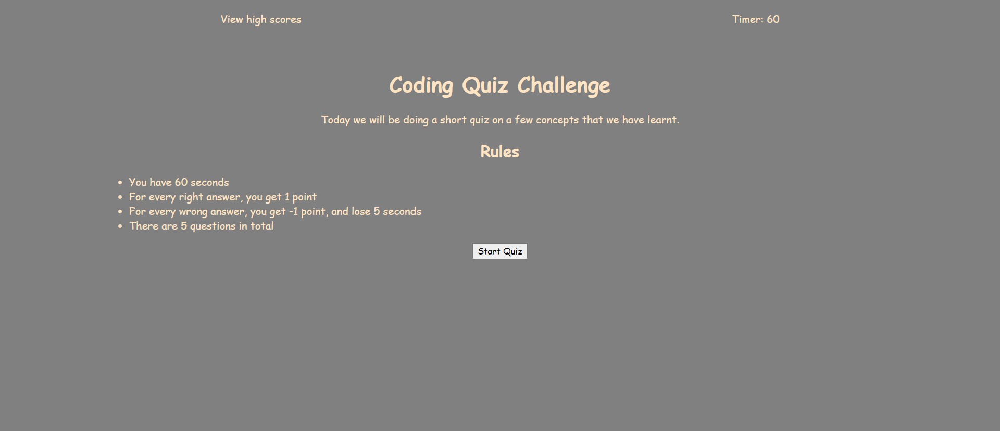

# <Coding-Quiz>

<!-- TABLE OF CONTENTS -->

  
Table of Contents

  <ol>
    <li>
      <a href="#description">Description</a>
    </li>
    <li><a href="#roadmap">Roadmap</a></li>
    <li><a href="#license">License</a></li>
    <li><a href="#contact">Contact</a></li>
    <li><a href="#acknowledgments">Acknowledgments</a></li>
  </ol>

<!-- ABOUT THE PROJECT -->
## Description

 
Start Page

**What?**

This is a quiz made with interactive features thanks to the integration of Javascript. This quiz consists of two webpages, one for the quiz, and another to show the user's scores as a result of taking the quiz. 

The quiz consists of 5 questions with four options in a multiple-choice question setup.

The user is given a total of 60 seconds to complete the quiz. However if the user picks a wrong option, they will be penalised with a reduction of 5 seconds taken off the timer, along with a score reduction of 1 point. 
If the right option is picked, they will be rewarded with 1 point. Thus, the user can accumalat

**Acquired Knowledge**

- Understanding in how to navigate to get a specific value within an array
- A lot of practice of querySelector and createElement method
- Some understanding of "event" 
- Additional methods learnt outside of class such linking into a new page, or reloading a page using Javascript
- Some practice on setInterval and clearInterval
- Debugging practice using chrome's dev tools
- A better understanding of JSON, and localStorage

(<a href="#readme-top">back to top</a>)

<!-- ROADMAP -->
## Roadmap
- [x] Start Page
- [x] Quiz Page
- [x] HighScore Page
- [x] Save Initials and Score

(<a href="#readme-top">back to top</a>)

<!-- LICENSE -->
## License

Distributed under the MIT License. See `LICENSE.txt` for more information.

(<a href="#readme-top">back to top</a>)

<!-- CONTACT -->
## Contact

Samuel Wai Weng Yong - <a href="mailto:samuelyongw@gmail.com"> samuelyongw@gmail.com </a>

Project Link: [Personal-Portfolio](https://github.com/KangaZero/kangazero.coding_quiz.io.git)

(<a href="#readme-top">back to top</a>)

<!-- ACKNOWLEDGMENTS -->
## Acknowledgments

Here are some of the resources used as reference to build this personal portfolio

* [Choose an Open Source License](https://choosealicense.com)
* [querySelector](https://developer.mozilla.org/en-US/docs/Web/API/Document/querySelector)
* [Math.random](https://developer.mozilla.org/en-US/docs/Web/JavaScript/Reference/Global_Objects/Math/random)
* [Array.splice](https://developer.mozilla.org/en-US/docs/Web/JavaScript/Reference/Global_Objects/Array/splice)
* [Window.location](https://developer.mozilla.org/en-US/docs/Web/API/Window/location)
* [location.reload](https://developer.mozilla.org/en-US/docs/Web/API/Location/reload.)
* [createElement](https://developer.mozilla.org/en-US/docs/Web/API/Document/createElement)
* [localStorage](https://developer.mozilla.org/en-US/docs/Web/API/Window/localStorage)
*[JSON](https://www.json.org/json-en.html)

In addition to these links, I would like to acknowledge and credit the help I had from a tutor in a one-on-one session. They have helped me in debugging my code, and allowing the options to show the proper text, and for event.target to recognise the boolean (but as a string), allowing my quiz to work. 

Here are their contact details:
- Name: Suresh Kumar
- Email: <a href="mailto:skumar2@instructors.2u.com"> skumar2@instructors.2u.com </a>

And small shout out to one of the TAs, Doug for fixing a small error for my localStorage function. 

(<a href="#readme-top">back to top</a>)

Thanks for reading 😄!

